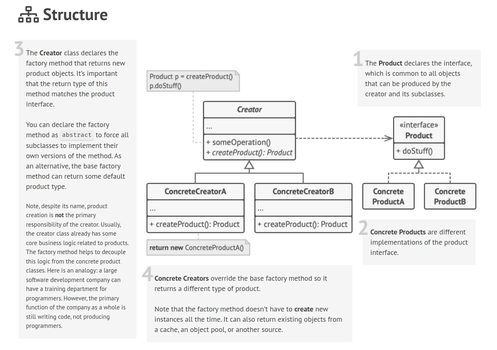
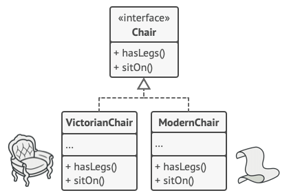
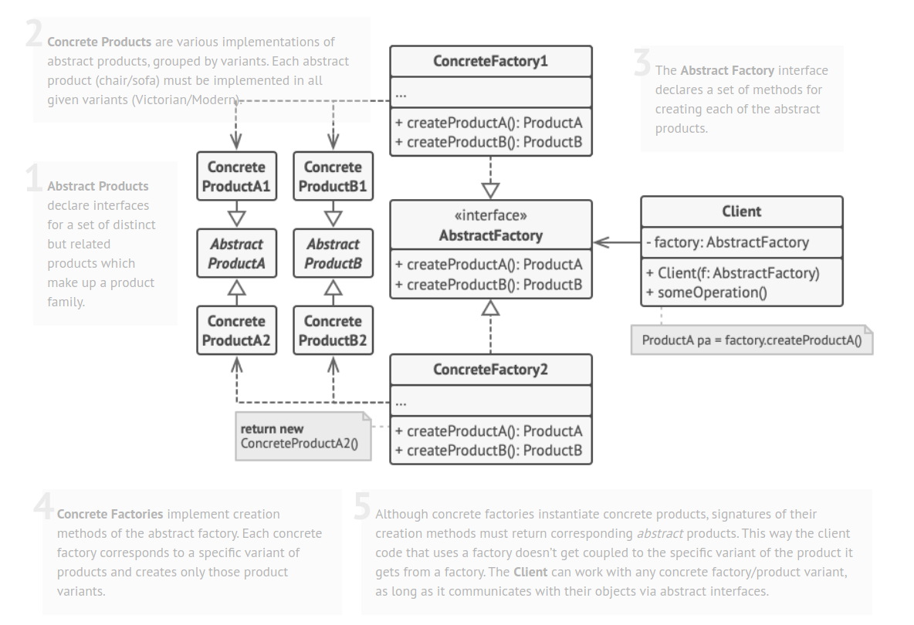
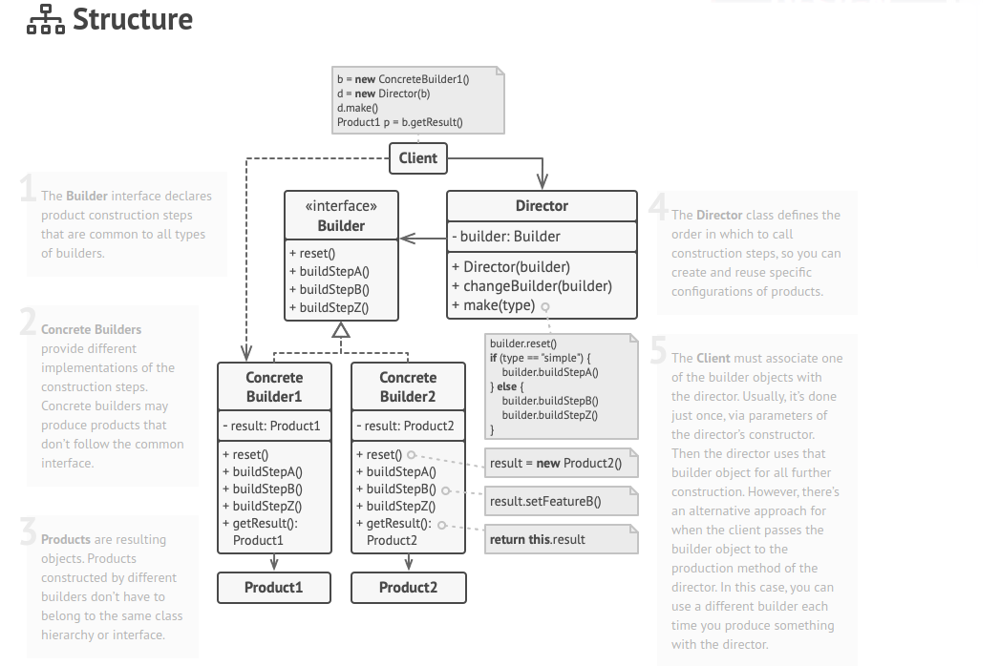
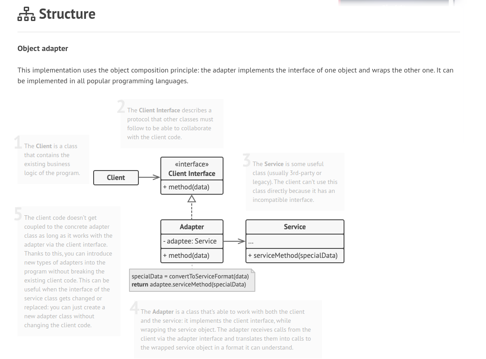

# Basics
## Design Patterns
### Creational patterns
provide object creation mechanisms that increase flexibility and reuse of existing code.
#### Factory Method
Factory Method is a creational design pattern that provides an interface for creating objects in a superclass, but allows subclasses to alter the type of objects that will be created.

##### problem:
Imagine that you’re creating a logistics management application. The first version of your app can only handle transportation by trucks, so the bulk of your code lives inside the Truck class.Adding Ships into the app would require making changes to the entire codebase.    
 
Factory Method can be used for creating cross-platform UI elements without coupling the client code to concrete UI classes

##### Applicability
* Use the Factory Method when you don’t know beforehand the exact types and dependencies of the objects your code should work with.

* The Factory Method separates product construction code from the code that actually uses the product. Therefore it’s easier to extend  the product construction code independently from the rest of the code.

For example, to add a new product type to the app, you’ll only need to create a new creator subclass and override the factory method in it.

* Use the Factory Method when you want to provide users of your library or framework with a way to extend its internal components.
*  Use the Factory Method when you want to save system resources by reusing existing objects instead of rebuilding them each time.

#### Abstract factory
* Let you produce family of related objects with out specifying their concrete class.

##### problem
1- you buy an victorian chair and then you want to get sofa you received modern sofa.
2- Furniture vendors update their catalogs very often, and you wouldn’t want to change the core code each time it happens.

##### Solution
The first thing the Abstract Factory pattern suggests is to explicitly declare interfaces for each distinct product of the product family (e.g., chair, sofa or coffee table). Then you can make all variants of products follow those interfaces.

##### Structure

#### Builder
* **Builder is a creational design pattern that lets you construct complex objects step by step. The pattern allows you to produce different types and representations of an object using the same construction code.**
  
#####  Problem
Imagine a complex object that requires laborious, step-by-step initialization of many fields and nested objects. Such initialization code is usually buried inside a monstrous constructor with lots of parameters. Or even worse: scattered all over the client code.
For example, let’s think about how to create a House object. To build a simple house, you need to construct four walls and a floor, install a door, fit a pair of windows, and build a roof. But what if you want a bigger, brighter house, with a backyard and other goodies (like a heating system, plumbing, and electrical wiring)?

The simplest solution is to extend the base House class and create a set of subclasses to cover all combinations of the parameters. But eventually you’ll end up with a considerable number of subclasses. Any new parameter, such as the porch style, will require growing this hierarchy even more.

#####  Solution
**The Builder pattern suggests that you extract the object construction code out of its own class and move it to separate objects called builders.**

The pattern organizes object construction into a set of steps (buildWalls, buildDoor, etc.). To create an object, you execute a series of these steps on a builder object. The important part is that you don’t need to call all of the steps. You can call only those steps that are necessary for producing a particular configuration of an object.

Some of the construction steps might require different implementation when you need to build various representations of the product. For example, walls of a cabin may be built of wood, but the castle walls must be built with stone.

In this case, you can create several different builder classes that implement the same set of building steps, but in a different manner. Then you can use these builders in the construction process (i.e., an ordered set of calls to the building steps) to produce different kinds of objects.

##### Director
You can go further and extract a series of calls to the builder steps you use to construct a product into a separate class called director. The director class defines the order in which to execute the building steps, while the builder provides the implementation for those steps.

#### Adapter
**Adapter is a structural design pattern that allows objects with incompatible interfaces to collaborate.**
##### Problem
Imagine that you’re creating a stock market monitoring app. The app downloads the stock data from multiple sources in XML format and then displays nice-looking charts and diagrams for the user.

At some point, you decide to improve the app by integrating a smart 3rd-party analytics library. But there’s a catch: the analytics library only works with data in JSON format.

##### Solution
Adapters can not only convert data into various formats but can also help objects with different interfaces collaborate. Here’s how it works:

The adapter gets an interface, compatible with one of the existing objects.
Using this interface, the existing object can safely call the adapter’s methods.
Upon receiving a call, the adapter passes the request to the second object, but in a format and order that the second object expects.

