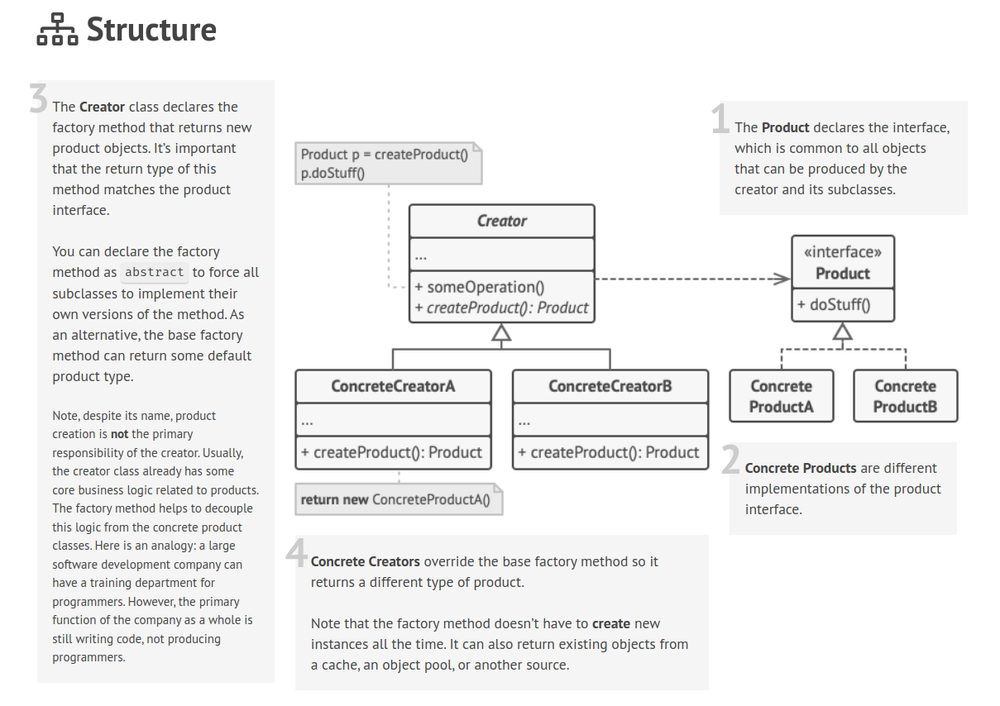
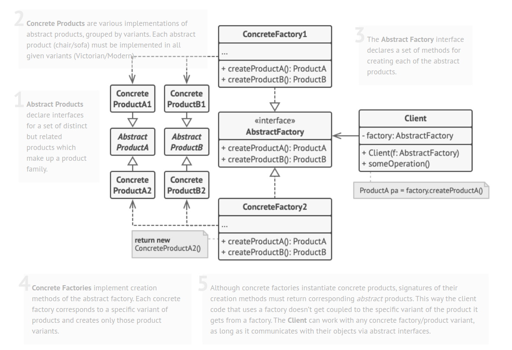

# Basics
## Design Patterns
### Creational patterns
provide object creation mechanisms that increase flexibility and reuse of existing code.
#### Factory Method
Factory Method is a creational design pattern that provides an interface for creating objects in a superclass, but allows subclasses to alter the type of objects that will be created.

##### problem:
Imagine that you’re creating a logistics management application. The first version of your app can only handle transportation by trucks, so the bulk of your code lives inside the Truck class.Adding Ships into the app would require making changes to the entire codebase.    
 
Factory Method can be used for creating cross-platform UI elements without coupling the client code to concrete UI classes

##### Applicability
* Use the Factory Method when you don’t know beforehand the exact types and dependencies of the objects your code should work with.

* The Factory Method separates product construction code from the code that actually uses the product. Therefore it’s easier to extend  the product construction code independently from the rest of the code.

For example, to add a new product type to the app, you’ll only need to create a new creator subclass and override the factory method in it.

* Use the Factory Method when you want to provide users of your library or framework with a way to extend its internal components.
*  Use the Factory Method when you want to save system resources by reusing existing objects instead of rebuilding them each time.

#### Abstract factory
* Let you produce family of related objects with out specifying their concrete class.

##### problem
1- you buy an victorian chair and then you want to get sofa you received modern sofa.
2- Furniture vendors update their catalogs very often, and you wouldn’t want to change the core code each time it happens.

##### Solution
The first thing the Abstract Factory pattern suggests is to explicitly declare interfaces for each distinct product of the product family (e.g., chair, sofa or coffee table). Then you can make all variants of products follow those interfaces.

##### Structure

